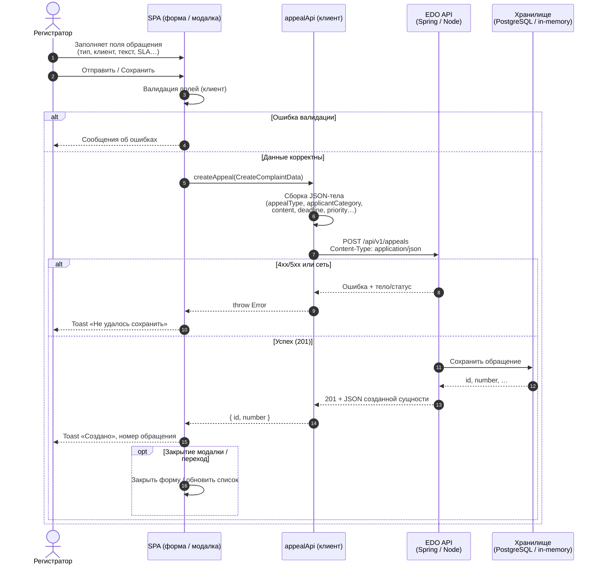
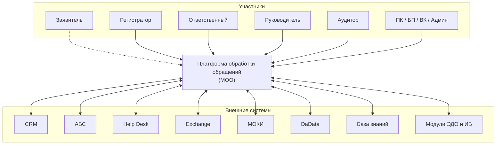
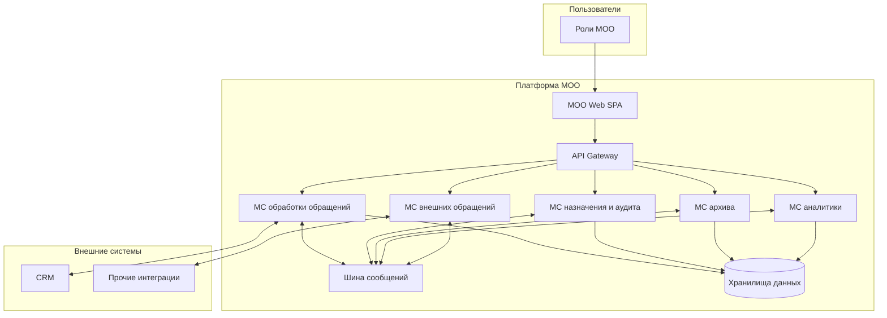
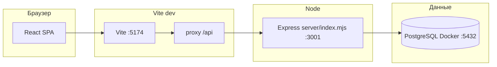

# EDO Bank

Веб-интерфейс **внутреннего модуля ЭДО** банка для департамента **ДУКО** (управление качеством обслуживания): учёт и обработка **обращений** клиентов и регулятора. Исходный UI-магнит: [Figma — EDO-Bank](https://www.figma.com/design/ohKA7YUB4W1nvmFqxpFa7G/EDO-Bank).

---

## 1. Для чего проект

- **Бизнес-цель:** навести порядок в обработке обращений, обеспечить **сроки** и **прослеживаемость** (в т.ч. требования регулятора по своевременным ответам).
- **Контекст заказчика и KPI:** сейчас в срок закрывается **91%** обращений; целевой ориентир — **99%**; после запуска решения — выйти на **99%** в течение **3 месяцев**; горизонт разработки решения — **6 месяцев**.
- **Фокус продукта:** не терять **устные** обращения (телефон, офис) — для них нужны те же уровни **регистрации, статусов и контроля SLA**, что и для письменного потока, в рамках утверждённого ТЗ.
- **Контекст:** легаси система в существующем банке не может быть доработана и новый модуль должен быть интегрирован в действующую архитектуру, поэтому в процессе решения мы подстраиваемся в то, что уже сейчас в проде.
- **Источник правды по смыслу «зачем»:** [`docs/core-source-context.md`](docs/core-source-context.md). Поведение экранов и полей — в [`docs/functional-requirements.md`](docs/functional-requirements.md) и связанных артефактах.




---

## 2. Архитектура проекта

Архитектурный контур **C4** (уровни *System Context* и *Container*): участники, внешние системы, целевые микросервисы МОО и шина — подробно в **[`docs/c4-architecture-overview.md`](docs/c4-architecture-overview.md)** (согласование с ТЗ, ADR-001/004, IcePanel). Здесь — пересобранные **Mermaid**-диаграммы в том же смысле, что в документе.

### C4 — уровень 1: системный контекст (МОО)

**МОО** — платформа обработки обращений; UI-прототип в репозитории — **EDO Bank**. Внешние системы и роли — сводно по [`docs/c4-architecture-overview.md`](docs/c4-architecture-overview.md) §2.



### C4 — уровень 2: контейнеры (целевая МОО)

Контейнеры **целевые** для проектирования бэкенда и интеграций; **в Git сейчас** в основном реализован **МОО Web (SPA)** и учебный контур «фронт ↔ API ↔ PostgreSQL» ([ADR-001](docs/adr/ADR-001-frontend-spa.md), [ADR-004](docs/adr/ADR-004-education-demo-backend.md)).



### Слои и стек в этом репозитории

| Слой | Технологии и расположение |
|------|---------------------------|
| **Клиент (SPA)** | **React 18** + **TypeScript**, сборка **Vite 6**, стили **Tailwind 4**, компоненты **Radix UI** / **MUI** и др. (`package.json`). Точка входа: `src/main.tsx`, корневое приложение: `src/app/App.tsx`. |
| **UI-код** | Экраны и виджеты в `src/app/components/` (в т.ч. жизненный цикл в `lifecycle/`), общие UI-примитивы в `src/app/components/ui/`. |
| **Данные и интеграция** | Сервисы в `src/services/` (HTTP, здоровье API, локальное хранилище там, где предусмотрено ТЗ), мок-данные в `src/data/`. |
| **Локальный API (демо)** | **Express** в `server/index.mjs` (порт **3001** по умолчанию), пул **PostgreSQL** через `pg`, эндпоинт **`GET /api/health`** для проверки БД. |
| **База данных** | **PostgreSQL 16** в **Docker** (`docker-compose.yml`), инициализация скриптами в `server/init/` (см. `server/init/README.md`). |
| **Сборка / dev-сервер** | Vite на порту **5174**, прокси **`/api` → `http://127.0.0.1:3001`** (`vite.config.ts`). В dev подключён плагин **`edoApiMockPlugin`** для моков OpenAPI там, где это нужно для UI. |
| **Документация и роли** | `docs/` — ТЗ, ADR, диаграммы, отчёты; `AGENTS.md` — роли Cursor; `roles/` — шаблоны навыков и при необходимости submodule сторонних навыков (`roles/README.md`). |
| **Учебный контур «фронт → API → БД»** | По плану курса СА описан **Spring Boot** + PostgreSQL в каталоге **`backend/`** и в [`docs/backend-development-plan.md`](docs/backend-development-plan.md) ([ADR-004](docs/adr/ADR-004-education-demo-backend.md)); текущий минимальный «живой» контур в репозитории — **Node API + Postgres** выше. |

### Локальная разработка (упрощённая схема репозитория)



Модель статусов обращения и переходы согласованы с ТЗ и описаны в [`docs/state-diagram.md`](docs/state-diagram.md) (в т.ч. для будущего REST по обращениям).

---

## 3. Флоу проекта

### Разработка и согласование с ТЗ

1. Прочитать [`docs/core-source-context.md`](docs/core-source-context.md) (контекст ДУКО и KPI).
2. Зафиксировать или изменить требования в [`docs/functional-requirements.md`](docs/functional-requirements.md) и при необходимости [`docs/business-requirements.md`](docs/business-requirements.md).
3. При изменениях UI — сверка с [`docs/ui-ux-brief.md`](docs/ui-ux-brief.md) / [`docs/design-system-plan.md`](docs/design-system-plan.md).
4. Реализация в `src/app/components/`, `src/services/`, `src/data/` с отсылкой к FR в задаче или коммите.
5. Проверка: запрос на сверку с ТЗ и использование навыков/ролей из `AGENTS.md` (в т.ч. `edo-qa-review`).

### Жизненный цикл обращения (продуктовый поток)

В упрощённом виде (детали и роли переходов — в [`docs/state-diagram.md`](docs/state-diagram.md)):

**Черновик** → **Зарегистрировано** → **Назначено** / **На ПК** → работа **на ответственном** (в т.ч. запросы в БП, подпись) → **Решено** → при необходимости **аудит** → **Закрыто** → **В архиве**; на отдельных шагах возможны **отказы** с фиксацией причины.

### Локальный запуск (кратко)

1. Поднять БД:

   ```bash
   npm run db:up
   ```

2. Переменные окружения (один раз):

   ```bash
   cp .env.example .env
   ```

3. Фронт + Node API (Vite проксирует `/api` на API, в шапке — индикатор доступности PostgreSQL):

   ```bash
   npm install
   npm run dev
   ```

Остановка контейнера: `npm run db:down`. Логи Postgres: `npm run db:logs`. Полный сброс volume и повторная инициализация init-скриптов: `npm run db:reset`. Если Postgres уже был создан **до** добавления `server/init/02-app-dictionary-and-appeals.sql`, накатите схему приложения: `npm run db:init-app` (контейнер должен быть запущен).

Только Vite: `npm run dev:vite` (индикатор **«БД offline»** — нормально: нет прокси на API). Только API (при уже запущенной БД): `npm run dev:api`.

**Netlify:** в панели сайта задайте **`DATABASE_URL`** (та же строка, что для локального наката). Сборка — `npm run build`, публикация — `dist/`; запросы **`/api/*`** проксируются на **`netlify/functions/api.mjs`**. Схему под API накатывайте скриптом **`npm run db:netlify-init`** (или `node scripts/netlify-db-init.mjs`; опция **`--erd`** добавляет `01-edo-schema.sql`; **`--dry-run`** — только порядок файлов). Перед запуском положите `DATABASE_URL` в `.env` или в окружение; при TLS-ошибках к облаку — **`PGSSL_REJECT_UNAUTHORIZED=0`**. Локально: `npx netlify dev`.

По умолчанию: приложение **http://localhost:5174**, Postgres **localhost:5432** (пользователь/БД `edo`, пароль `edo`). После смены DDL см. `server/init/README.md` (часто нужен пересозданный volume: `docker compose down -v && docker compose up -d`).

Если репозиторий клонировали **без** submodule с навыками, один раз подтяните его:

```bash
git submodule update --init --recursive roles/claude-skills
```

---

## Полезные ссылки по репозиторию

| Путь | Содержание |
|------|------------|
| `AGENTS.md`, `.cursor/rules/`, `.cursor/skills/edo-*` | Роли и проектные навыки Cursor для работы по ТЗ EDO Bank |
| `docs/c4-architecture-overview.md` | C4: контекст МОО, контейнеры, внешние системы (полный текст и таблицы) |
| `docs/reports/` | Канвас-отчёты и WakaTime, см. `docs/reports/README.md` |
| `docs/ui-artifacts/` | Исторические UI-заметки |
| `src/openapi/` | OpenAPI контракты (в т.ч. для моков/доков) |
| `roles/README.md` | Навыки в формате Anthropic и submodule [claude-skills](https://github.com/alirezarezvani/claude-skills) |
| `roles/kafka-skills-sh/` | Kafka: [skills.sh](https://skills.sh/?q=kafka), vendored `SKILL.md`; в Cursor — навык `edo-kafka-integration` |
| `netlify.toml`, `netlify/functions/api.mjs` | Netlify: статический `dist/` + rewrite **`/api/*`** на serverless Express (ручки `/api/appeals`, `/api/health`, `/api/v1/...`) |
| `scripts/netlify-db-init.mjs`, `npm run db:netlify-init` | Накат `server/init/*.sql` на облачный Postgres под тот же `DATABASE_URL`, что в Netlify |

Репозиторий на GitHub: [Solodovnick/edo](https://github.com/Solodovnick/edo).
