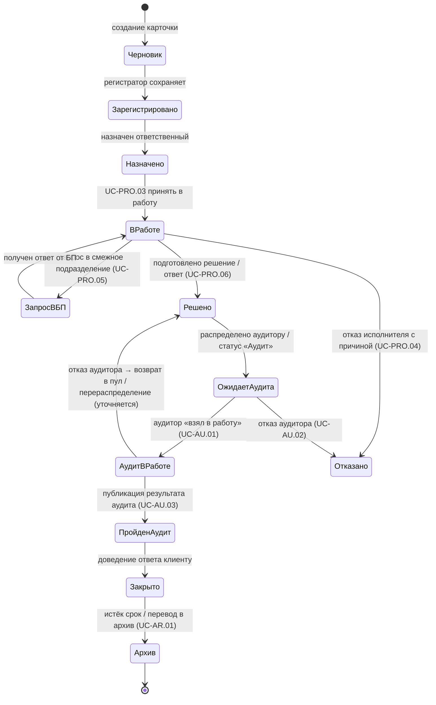

# Диаграмма состояний — жизненный цикл обращения

**Version:** 1.1.0 | **Date:** 2026-05-03 | **Status:** Active  
**Источник:** `docs/functional-requirements.md`, фрагменты UC аудита (`UC-AU.*`), протоколы и реестр UC в `docs/external-registry/use-case-registry.csv`.

---

## Уточнение по статусам

В исходных текстах UC аудита встречаются формулировки **«В архиве»**, **«Пройден аудит»**, распределение из **пула аудитору** (Au-xxxx). Их нужно согласовать с единым справочником статусов в конфигурации/БД. Ниже — **объединённая модель для прототипа**: переходы можно поэтапно подтягивать к данным в `src/data/`.

---

## Диаграмма (Mermaid)

---

## Текстовая схема (кратко)

1. Регистрация → **Зарегистрировано**.  
2. Назначение → **В работе** у ответственного.  
3. При необходимости → **Запрос в БП** → возврат в работу.  
4. Готовность решения → **Решено**.  
5. Линия аудита → пул / **ожидание аудита** → **аудит в работе** → **пройден аудит** (или возврат при отказе).  
6. Закрытие → **Архив**.

---

## TODO

- [ ] Сверить каждый переход с актуальными статусами в mock `src/data/` и справочником заказчика.
- [ ] Устранить противоречие в текстах UC-AU (архив сразу vs «пройден аудит»).
