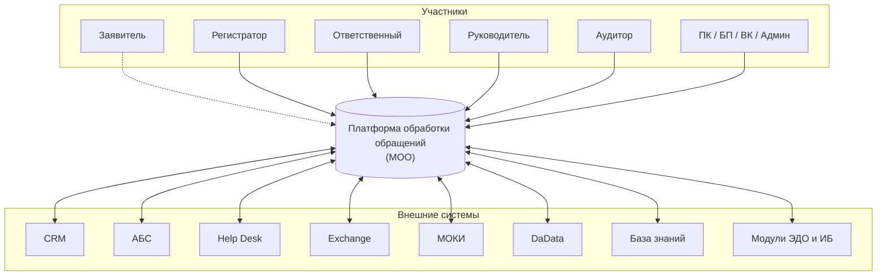
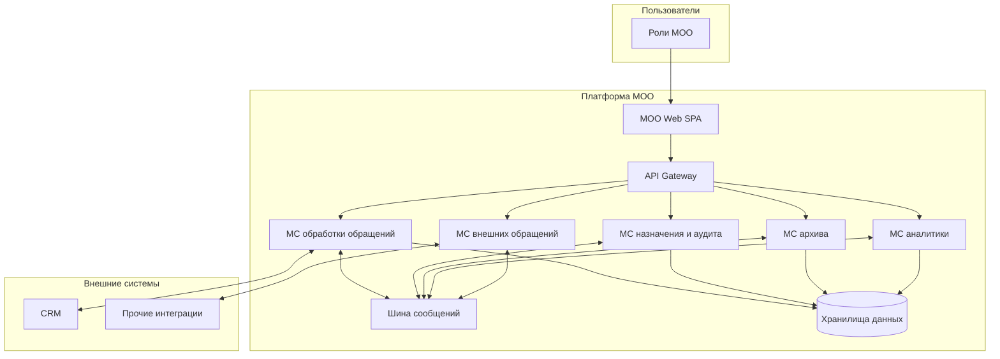

# Архитектура C4 — верхний уровень (МОО / EDO Bank)

**Version:** 1.0.1 | **Date:** 2026-05-03 | **Status:** Draft  

**Охват документа:** уровни **C4 — System Context** и **Container**; уровни Component / Code **не** описываются (детализация — в отдельных артефактах и модели IcePanel).

**Источники и согласование:** `docs/business-requirements.md`, `docs/functional-requirements.md`, `docs/use-case.md`, реестр UC; целевая системная декомпозиция уточняется по ландшафту IcePanel (`docs/incoming-artifacts/use-cases-export-594e282f/` — смежный пакет сценариев и модель).  

**Текущая реализация в репозитории:** по [ADR-001](adr/ADR-001-frontend-spa.md) — только **SPA** с mock-данными; остальные контейнеры ниже — **целевая** серверная архитектура для последующих этапов и ADR по интеграциям ([FR-16](functional-requirements.md)).

**Учебная демонстрация** (итоговый проект по системному анализу): упрощённый контур «SPA ↔ один REST API ↔ PostgreSQL» — [ADR-004](adr/ADR-004-education-demo-backend.md), [план бэкенда](backend-development-plan.md); не эквивалентен полному ландшафту контейнеров ниже.

---

## 1. Назначение

Зафиксировать **архитектурный контур**: кто взаимодействует с платформой обработки обращений, какие внешние системы подключаются, какие крупные исполняемые части (контейнеры) входят в состав решения.

---

## 2. Уровень 1 — System Context

### 2.1. Центральная система

| Элемент | Описание |
|---------|----------|
| **Платформа обработки обращений (МОО)** | Единый контур регистрации, маршрутизации, решения, аудита и архива обращений; клиентские кабинеты и интеграции с корпоративным ландшафтом. В ТЗ прототип UI именуется в том числе **EDO Bank**. |

### 2.2. Участники (люди и организации)

Сводно по ролям из реестра UC и ТЗ (без перечисления экранов):

| Группа | Роли |
|--------|------|
| Обслуживание клиента | Заявитель (клиент банка) |
| Линия обработки | Регистратор, Ответственный специалист, Руководитель линии |
| Контроль качества | Аудитор |
| Прочие участники процесса | Секретарь претензионной комиссии, сотрудник смежного БП, сотрудник ВК, администратор |

### 2.3. Внешние системы (за границей МОО)

| Система | Назначение в контуре (архитектурно) |
|---------|-------------------------------------|
| **CRM** | Клиентская база, комментарии и контекст по клиенту ([FR-06](functional-requirements.md)). |
| **АБС** | Банковские продукты и счета (справочно для обращений). |
| **Help Desk** | Канал учёта инцидентов / смежный контур (по ландшафту интеграций). |
| **Exchange (direct)** | Корпоративная почта / маршрутизация сообщений. |
| **МОКИ** | Кадровые/оргданные данные сотрудников; интеграция после ADR и ИБ ([FR-16.1](functional-requirements.md)). |
| **DaData** | Справочник и проверка данных по юрлицам (UC-INT-02). |
| **База знаний** | Контент для ответов и классификации (в ландшафте может быть отдельным фронтом). |
| **Модули ЭДО / корпоративного контура** | Авторизация, внутренняя переписка, внешняя корреспонденция, обмен кадровой информацией, электронная подпись — как **внешние** к МОО сервисы при интеграции. |

Точные протоколы и границы ответственности по каждой связи фиксируются отдельными ADR и не являются предметом этого верхнего уровня.

### 2.4. Диаграмма контекста (обзорная)

---

## 3. Уровень 2 — Containers

### 3.1. Общая декомпозиция

Внутри границы **МОО** (логическое приложение «банк обработки обращений») выделяются типовые **контейнеры** — независимо развёртываемые части (веб, API, сервисы, шина, данные). Ниже — архитектурный состав, согласованный с обсуждаемым ландшафтом (IcePanel): маршрутизация запросов, доменные микросервисы, интеграционный слой, хранилища.

| Контейнер | Тип | Назначение |
|-----------|-----|------------|
| **МОО Web (SPA)** | Веб-приложение | Единая точка входа для кабинетов ролей; UI EDO Bank в репозитории соответствует этому контейнеру на этапе прототипа. |
| **API Gateway** | Шлюз | Маршрутизация и политики доступа к внутренним API (например, NGINX / аналог). |
| **Микросервис обработки обращений** | Сервис | Ядро домена: жизненный цикл обращения, статусы, назначения, бизнес-процессы по UC-PRO / UC-REG и др. |
| **Микросервис назначения ответственного и аудита** | Сервис | Логика аудита, правила назначения, связанные с UC-AU / UC-RU (по модели). |
| **Микросервис архива** | Сервис | Долговременное хранение и выборки по архивным обращениям (UC-AR). |
| **Микросервис аналитики** | Сервис | Показатели, отчёты, KPI ([business-requirements.md](business-requirements.md)). |
| **Микросервис внешних обращений (адаптер)** | Сервис | Приём событий и данных из внешних каналов / систем. |
| **Шина сообщений** | Инфраструктура | Асинхронный обмен событиями между сервисами (в модели — kafka-подобный контур; конкретная технология — по ADR). |
| **Хранилища данных** | БД / объекты | Персистентность доменных сущностей; в ландшафте допускается разделение OLTP / реплик / тематических БД. |

### 3.2. Связь с прототипом

| Контейнер | Статус в текущем репозитории |
|-----------|------------------------------|
| МОО Web (SPA) | Реализуется (React + Vite), данные mock ([ADR-001](adr/ADR-001-frontend-spa.md)). |
| API Gateway, микросервисы, шина, БД | Не реализованы; описание **целевое** для проектирования бэкенда и интеграций. |

### 3.3. Диаграмма контейнеров (обзорная)

---

## 4. Границы документа

- **Не входит:** детализация REST/Kafka-топиков, схем БД, внутренняя структура микросервисов (уровень Component в C4) — при необходимости оформляется отдельно или в IcePanel.
- **Изменения:** любое расхождение с продуктовым ТЗ решается обновлением `docs/functional-requirements.md` / BR и ссылки на этот документ.

---

## Связанные артефакты

- [State diagram](state-diagram.md) — жизненный цикл обращения на уровне предметной области.
- [Use cases](use-case.md), [реестр UC](use-case-registry.md).
- [ADR-001](adr/ADR-001-frontend-spa.md) — границы текущего UI-прототипа.
