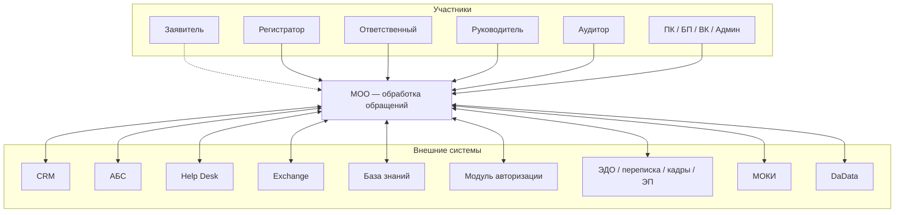
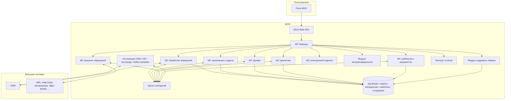

# Архитектура C4 — МОО / EDO Bank

**Version:** 1.1.0 | **Date:** 2026-05-06 | **Status:** Draft  

**Охват:** уровни **C4 — System Context** и **Container**. Уровни Component / Code здесь не детализируются (см. IcePanel и ТЗ).

**Источники:** `docs/core-source-context.md`, `docs/business-requirements.md`, `docs/functional-requirements.md`, реестр UC; **IcePanel** — экспорт модели (`c3 app` / `c4 context`, одинаковый набор `modelObjects`): шлюз, микросервисы внутри **МОО**, интеграционные приложения, БД-хранилища, внешние системы.

**Репозиторий:** [ADR-001](adr/ADR-001-frontend-spa.md) — SPA прототип **EDO Bank** как **МОО Web**; [ADR-004](adr/ADR-004-education-demo-backend.md) — учебный контур **SPA ↔ REST API ↔ PostgreSQL** (не полный ландшафт микросервисов ниже).

---

## 1. Назначение

Зафиксировать **архитектурный контур**: участники, граница **МОО**, внешние системы; внутри МОО — **контейнеры** (веб, шлюз, микросервисы, интеграции, данные), согласованные с моделью IcePanel и продуктовым ТЗ.

---

## 2. Уровень 1 — System Context

### 2.1. Центральная система

| Элемент | Описание |
|---------|----------|
| **МОО** (модуль обработки обращений) | Регистрация, маршрутизация, решение, аудит, архив; кабинеты ролей. В ТЗ UI-прототип — **EDO Bank**. В IcePanel: система «МОО», описание — электронный документооборот по обращениям. |

### 2.2. Участники

| Группа | Роли (IcePanel actors + ТЗ) |
|--------|------------------------------|
| Клиент | Заявитель |
| Линия | Регистратор, Ответственный, Руководитель |
| Качество / контроль | Аудитор, Сотрудник отдела внутреннего контроля |
| Процессы | Секретарь, Претензионная комиссия, Сотрудник БП, Администратор |

### 2.3. Внешние системы (за границей ядра МОО)

Сводка по ТЗ и по **системным** узлам IcePanel (соседи МОО на контекстной диаграмме):

| Система | Назначение |
|---------|------------|
| **CRM** | Клиентская база, контекст по клиенту ([FR-06](functional-requirements.md)). |
| **АБС** | Продукты и счета (справочно для обращений). |
| **Help Desk** | Смежный контур инцидентов. |
| **Exchange (direct)** | Корпоративная почта / маршрутизация. |
| **База знаний** | Контент для ответов (в модели может быть отдельным фронтом). |
| **Модуль авторизации** | Единый вход / AD (в интеграциях). |
| **Модули ЭДО / переписка / кадры / подпись** | В IcePanel выделены отдельными системами: внутренняя и внешняя корреспонденция, обмен кадровой информацией, электронная подпись — подключаются как внешние сервисы при интеграции. |
| **МОКИ** | Кадровые/оргданные данные ([FR-16.1](functional-requirements.md)) — в контексте ТЗ; в IcePanel частично покрыто модулями обмена кадровой информацией. |
| **DaData** | Справочники и проверки по юрлицам (UC-INT-02) — в ТЗ; на IcePanel-экспорте может не быть отдельным узлом, оставляем в контексте по ТЗ. |

Протоколы и ADR по каждой связи — вне рамок этого файла.

### 2.4. Диаграмма контекста

---

## 3. Уровень 2 — Containers (внутри МОО, по IcePanel)

В родителе **МОО** в IcePanel сгруппированы приложения (**type: app**): веб-фронт, **API Gateway NGINX**, микросервисы домена, модули распределения и подписания, а также интеграционные приложения (CRM / HelpDesk / Exchange / Kafka metadata и т.д.). Ниже — **нормализованные** имена (опечатки в экспорте исправлены), логическая группировка для C4.

### 3.1. Таблица контейнеров

| Контейнер | Тип | Назначение (IcePanel + ТЗ) |
|-----------|-----|----------------------------|
| **МОО Web (SPA)** | Web | Единая точка входа кабинетов; в репозитории — **EDO Bank** ([ADR-001](adr/ADR-001-frontend-spa.md)). |
| **API Gateway** | Шлюз | NGINX-маршрутизатор запросов к внутренним API. |
| **Микросервис обработки обращений** | Service | Ядро ЖЦ обращения: регистрация, статусы, обработка ([FR-02](functional-requirements.md) и UC регистратора/ответственного). |
| **Микросервис назначения и аудита** | Service | Назначение ответственного, аудит ([FR-13](functional-requirements.md), UC-AU / UC-RU). |
| **Микросервис архива** | Service | Архивные обращения (UC-AR). |
| **Микросервис аналитики** | Service | Показатели и отчёты, KPI ([BR](business-requirements.md)). |
| **Микросервис внешних обращений** | Service | Адаптер внешних каналов и систем. |
| **Микросервис шаблонов и документов** | Service | Шаблоны ответов, документы, отчёты. |
| **Микросервис электронной подписи** | Service | Проверка права подписи, УКЭП (в модели — отдельный контейнер и модули подписи). |
| **Модуль автоматического распределения** | Service | Распределение нагрузки / очередей обращений. |
| **Модуль обмена кадровой информацией** | Service | Интеграция с кадровым контуром (см. МОКИ / сотрудники). |
| **Формирование и экспорт отчётов** | Service | Экспорт отчётности. |
| **Интеграционные адаптеры** | Service | В модели: CRM communication, HelpDesk communication, Direct Exchange, Kafka **Topic: metadata**, аппаратные/программные адаптеры — сводим к слою «интеграции с внешним миром и шиной». |
| **Шина / асинхронность** | Infra | Обмен событиями (в IcePanel — топики и связи «metadata»; технология — по ADR, напр. Kafka). |
| **Хранилища** | DB | В IcePanel **store**: БД Master, replica, метаданных, шаблонов, сотрудников — архитектурно OLTP + тематические БД / реплики. |

### 3.2. Статус в репозитории Git

| Контейнер | В коде сейчас |
|-----------|----------------|
| МОО Web (SPA) | Да — React + Vite (`src/app/`). |
| API Gateway, микросервисы, шина | Целевая архитектура; не развёрнуты как отдельные сервисы. |
| REST + PostgreSQL | Учебный контур [ADR-004](adr/ADR-004-education-demo-backend.md): `server/`, `netlify/functions/api.mjs`, `server/init/`. |

### 3.3. Диаграмма контейнеров

---

## 4. Связь с IcePanel

Экспорты **`c3 app icepanel.json`** и **`c4 context icepanel.json`** содержат одинаковый набор из **77** `modelObjects`: актёры, система **МОО**, внешние системы, приложения внутри МОО, компоненты (ядро обращений, архивация, база знаний и др.), группы «Базы данных» / «ЭДО», хранилища. Диаграммы выше **обобщают** эту модель для документации репозитория; детальные связи (`modelConnections`) остаются в IcePanel.

---

## 5. Границы документа

- Не входит: REST/Kafka контракты, схемы таблиц, внутренняя структура каждого микросервиса (C4 Component).
- Расхождения с ТЗ: сначала правки в `docs/functional-requirements.md` / BR, затем этот документ и IcePanel.

---

## Связанные артефакты

- [State diagram](state-diagram.md) — жизненный цикл обращения.
- [Use cases](use-case.md), [реестр UC](use-case-registry.md).
- [ADR-001](adr/ADR-001-frontend-spa.md), [ADR-004](adr/ADR-004-education-demo-backend.md).
- [План бэкенда](backend-development-plan.md).
