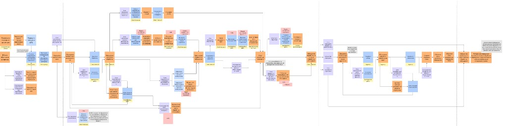

# Event Storming — EDO Bank

**Version:** 1.1.0 | **Date:** 2026-05-03 | **Status:** Draft  

**Назначение:** зафиксировать **обзорный процессный контур** по домену обработки обращений (каналы → регистрация → исполнение → контроль → архив) на основе визуальной модели. Документ **не** заменяет `docs/functional-requirements.md`; расхождения с ТЗ разрешаются через обновление FR и связанных артефактов.

**Связь с архитектурой:** см. [`c4-architecture-overview.md`](c4-architecture-overview.md).

---

## Диаграмма процесса (источник визуализации)

*Файл в репозитории:* `docs/assets/event-storming-process-overview.png`

---

## Три логические зоны потока

Вертикальные границы на схеме делят жизненный цикл на три участка: приём, ядро обработки, завершение.

### Зона 1 — Приём и первичная обработка

| Элемент | Назначение |
|---------|------------|
| Каналы входа | Звонок, почта, web — точки поступления обращения. |
| Контакт-центр (КЦ) | Первичный контур работы с обращением. |
| Блок обработки заявок | Тriage: в т.ч. потоки «жалобы» и «прочие вопросы». |

### Зона 2 — Ядро (идентификация, регистрация, исполнение)

| Элемент | Назначение |
|---------|------------|
| MDM | Проверка / обогащение данных клиента («мастер» справочных данных). |
| Обогащение обращения | Дополнение контекста перед регистрацией. |
| CRM | Проверка на дубли, история по клиенту. |
| Регистрация обращения | Фиксация обращения в системе (близко UC-REG.* в реестре). |
| BPM / workflow | Назначение ответственного, маршрутизация задач. |
| Обработка обращения | Основное исполнение (решение, запросы в БП и др. по UC). |
| Информирование клиента | Уведомления по статусам через доступные каналы. |

### Зона 3 — Завершение

| Элемент | Назначение |
|---------|------------|
| Контроль качества | Проверка результата (в продуктовой линии — связка с аудитом UC-AU.*). |
| Закрытие обращения | Финальный переход статуса. |
| Архивация | Долговременное хранение (UC-AR.*). |

---

## Системные контуры (для сопоставления с C4)

На схеме фигурируют внешние и внутренние контуры: **MDM**, **CRM**, **движок BPM/workflow**, **сервис уведомлений**, **архив/хранилище**. Их развёрнутое описание на уровне контейнеров — в [`c4-architecture-overview.md`](c4-architecture-overview.md). Интеграции с МОКИ, DaData и др. — по FR-16 и ADR.

---

## Черновик доменных заготовок (для будущей детализации)

Ниже — ранее зафиксированные заготовки событий/команд; их нужно **согласовать** с полной сессией Event Storming и ТЗ.

### Домен: Регистрация обращений

- **Events:** ОбращениеЗарегистрировано, КатегорияОпределена, ОтветственныйНазначен  
- **Commands:** ЗарегистрироватьОбращение, НазначитьОтветственного  
- **Aggregates:** Обращение  

### Домен: Обработка обращений

- **Events:** РешениеПодготовлено, ОбращениеЭскалировано, ЗапросОтправленВБП  
- **Commands:** ПодготовитьРешение, ЭскалироватьОбращение  
- **Aggregates:** Обращение, Решение  

### Домен: Аудит / контроль качества

- **Events:** АудитНачат, РезультатАудитаОпубликован  
- **Commands:** НачатьАудит, ОпубликоватьРезультат  
- **Aggregates:** АудиторскаяЗапись  

### Домен: SLA

- **Events:** ДедлайнПриближается, ДедлайнНарушен  
- **Commands:** — (мониторинг)  
- **Aggregates:** SLAПравило  

---

## Дальнейшие шаги

- [ ] Сверка терминов зон и блоков с `docs/functional-requirements.md` и `docs/use-case.md`.  
- [ ] Уточнение bounded contexts и карт контекстов.  
- [ ] Связь с [User Story Map](user-story-map.md) (A-006), когда артефакт будет заполнен.
