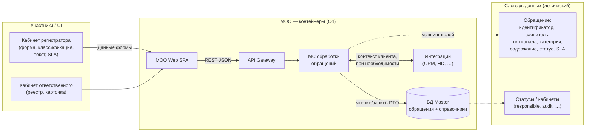
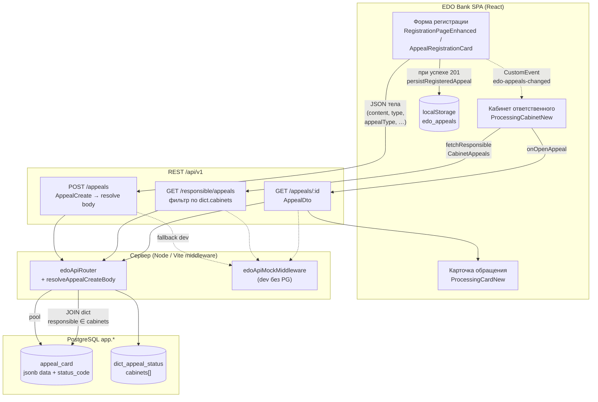

# Data flow: обращение от регистрации до кабинета ответственного (МОО / EDO Bank)

**Версия:** 1.0.0 | **Дата:** 2026-05-06 | **Формат:** Mermaid в Markdown  

**Основание:** [C4 / контейнеры МОО](../c4-architecture-overview.md) (уровни контекста и контейнеров; ссылка на экспорт IcePanel **C3 app** / **C4 context** — `docs/input/c3 app icepanel.json`, `docs/input/c4 context icepanel.json`), [глоссарий и объект «Обращение»](../glossary.md), полный [словарь данных](../incoming-artifacts/slovar-dannykh/Словарьданных.md), [маппинг REST по кабинетам](../api-cabinets.md), UI-наследие регистрации ([`../ui-artifacts/REGISTRATION_PAGE_UPDATE.md`](../ui-artifacts/REGISTRATION_PAGE_UPDATE.md), задача [`frontend-task-registration-appeal-form.md`](frontend-task-registration-appeal-form.md)), [ADR-004](../adr/ADR-004-education-demo-backend.md).

Ниже два слоя: **целевая архитектура IcePanel/C4** (логический поток данных) и **учебный контур в репозитории** (фактические узлы и REST).

---

## 1. Целевой поток данных (C4: МОО Web → Gateway → ядро → БД + интеграции)

Отражает контейнерную диаграмму из [`c4-architecture-overview.md` §3.3](../c4-architecture-overview.md): данные обращения проходят через шлюз к микросервису обработки и в OLTP-хранилище; справочники статусов и клиентский контекст согласованы со **словарём данных**; CRM и прочие системы — по необходимости UC (FR-06 и др.).

---

## 2. Поток данных в репозитории (SPA ↔ REST v1 ↔ PostgreSQL / мок)

Соответствует реализованному сценарию: **регистрация** (`POST /api/v1/appeals`), **реестр ответственного** (`GET /api/v1/responsible/appeals`), **полная карточка** (`GET /api/v1/appeals/{id}`), таблица `app.appeal_card` и словарь `app.dict_appeal_status` ([`api-cabinets.md` §1–3](../api-cabinets.md)). Клиентский кэш `localStorage` и событие обновления списка — дополнительный контур UI, не заменяющий запись в БД при успешном POST.

---

## 3. Согласование с C3 / IcePanel

Файлы **`docs/input/c3 app icepanel.json`** и **`docs/input/c4 context icepanel.json`** (см. [§4 `c4-architecture-overview.md`](../c4-architecture-overview.md)) описывают **приложения** внутри МОО и связи `modelConnections`. Логические потоки данных на диаграммах выше **сводят** цепочку «веб → API → хранилище обращений» к узлам, совместимым с C3/C4 без дублирования полного графа из 77 объектов IcePanel.

---

## 4. Связанные документы

| Документ | Назначение |
|----------|------------|
| [`sequence-appeal-creation.md`](../sequence-appeal-creation.md) | Пошаговая последовательность UI → API (при наличии в репозитории) |
| [`rest-api-post-appeals-create.md`](rest-api-post-appeals-create.md) | Описание метода создания обращения |
| [`docs/ui-ux-brief.md`](../ui-ux-brief.md), [`docs/design-system-plan.md`](../design-system-plan.md) | Ограничения UI |
