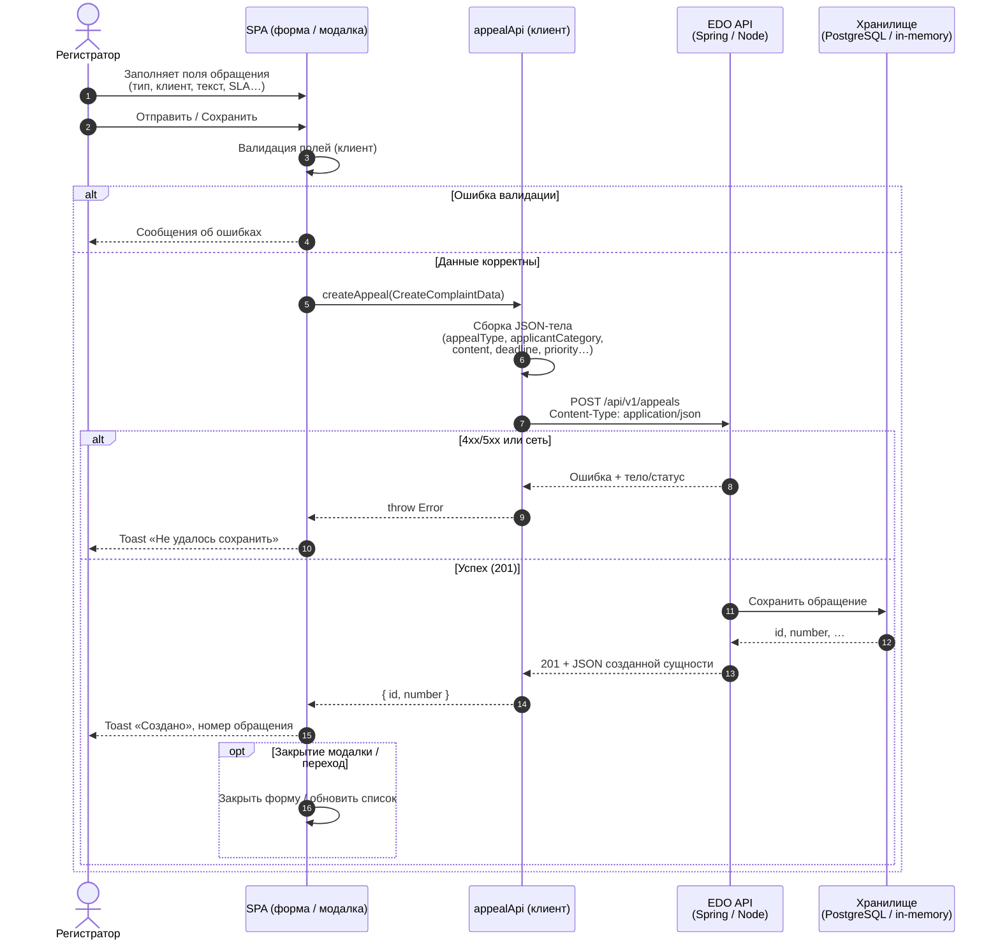

# Sequence: создание обращения

Диаграмма последовательности для сценария создания обращения через REST (`POST /api/v1/appeals`, клиент `createAppeal` в `src/services/appealApi.ts`).

## Примечание

Отдельный путь — регистрация только в браузере (`appealStorage` / localStorage) без вызова `POST /api/v1/appeals`; при необходимости его можно оформить отдельной диаграммой.
