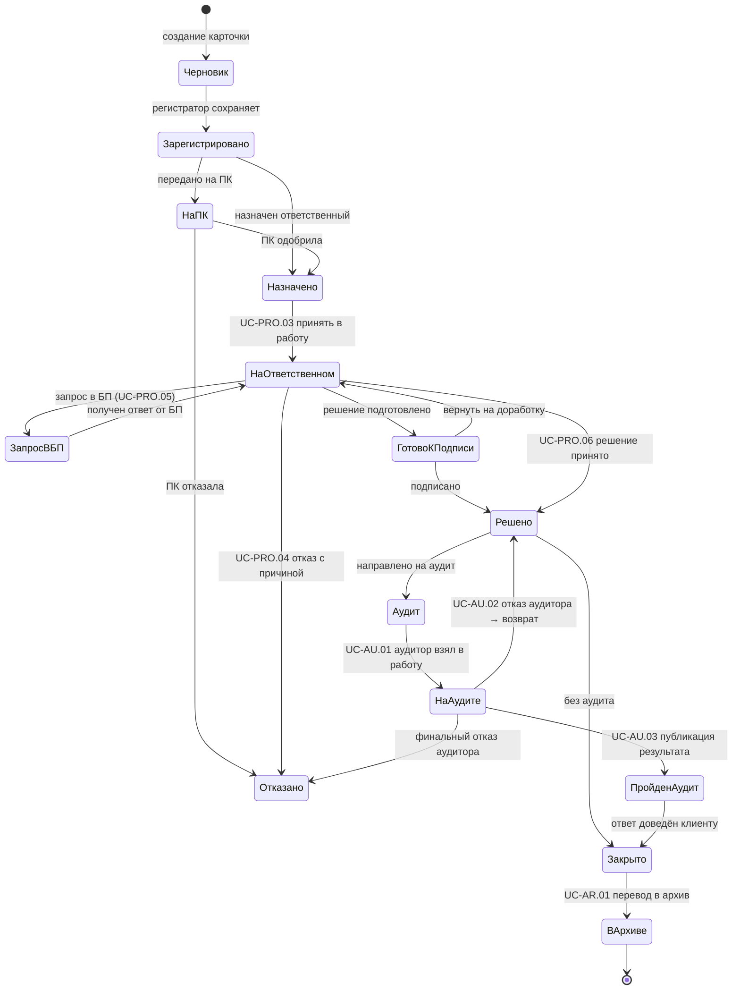

# Диаграмма состояний — жизненный цикл обращения

**Version:** 1.2.0 | **Date:** 2026-05-04 | **Status:** Active  
**Источник:** `docs/functional-requirements.md`, UC аудита (`UC-AU.*`), реестр UC; **синхронизировано с** `backend/src/main/java/bank/edo/service/AppealService.java` (TRANSITIONS map).

---

## Справочник статусов (единые имена для БД, API и UI)

| Статус | Код в БД / API | Описание |
|--------|----------------|----------|
| Черновик | `Черновик` | Карточка создана, не зарегистрирована |
| Зарегистрировано | `Зарегистрировано` | Регистратор сохранил обращение |
| Назначено | `Назначено` | Назначен ответственный |
| На ПК | `На ПК` | Передано на Претензионную комиссию |
| На ответственном, взято | `На ответственном, взято` | Ответственный принял в работу (UC-PRO.03) |
| Запрос в БП | `Запрос в БП` | Запрос в смежное подразделение (UC-PRO.05) |
| Готово к подписи | `Готово к подписи` | Решение подготовлено, ожидает подписи |
| Решено | `Решено` | Решение принято / ответ подготовлен (UC-PRO.06) |
| Аудит | `Аудит` | Передано в очередь аудита |
| На аудите | `На аудите` | Аудитор взял в работу (UC-AU.01) |
| Пройден аудит | `Пройден аудит` | Аудит опубликован (UC-AU.03) |
| Закрыто | `Закрыто` | Ответ доведён до клиента |
| В архиве | `В архиве` | Перемещено в архив (UC-AR.01) |
| Отказано | `Отказано` | Отказ исполнителя или аудитора с причиной |

---

## Диаграмма (Mermaid)

> **Псевдонимы в Mermaid** (без пробелов): `НаПК` = «На ПК»; `НаОтветственном` = «На ответственном, взято»; `ЗапросВБП` = «Запрос в БП»; `ГотовоКПодписи` = «Готово к подписи»; `НаАудите` = «На аудите»; `ПройденАудит` = «Пройден аудит»; `ВАрхиве` = «В архиве».

---

## Матрица переходов по ролям

| От статуса | К статусу | Роль |
|-----------|-----------|------|
| Черновик | Зарегистрировано | Регистратор |
| Зарегистрировано | Назначено | Руководитель |
| Зарегистрировано | На ПК | Руководитель |
| На ПК | Назначено / Отказано | Секретарь ПК |
| Назначено | На ответственном, взято | Ответственный |
| На ответственном, взято | Запрос в БП | Ответственный |
| Запрос в БП | На ответственном, взято | Ответственный |
| На ответственном, взято | Готово к подписи | Ответственный |
| Готово к подписи | На ответственном, взято / Решено | Руководитель |
| На ответственном, взято | Решено | Ответственный |
| На ответственном, взято | Отказано | Ответственный |
| Решено | Аудит / Закрыто | Руководитель |
| Аудит | На аудите | Аудитор |
| На аудите | Решено / Пройден аудит / Отказано | Аудитор |
| Пройден аудит | Закрыто | Руководитель |
| Закрыто | В архиве | Система / Руководитель |

---

## Текстовая схема (кратко)

1. Регистрация → **Зарегистрировано**.  
2. Опционально → **На ПК** (Претензионная комиссия) → **Назначено** или **Отказано**.  
3. Назначение → **На ответственном, взято**.  
4. При необходимости → **Запрос в БП** → возврат на ответственного.  
5. Решение → **Готово к подписи** → **Решено** (или напрямую).  
6. Линия аудита → **Аудит** → **На аудите** → **Пройден аудит** (или возврат/отказ).  
7. Закрытие → **Закрыто** → **В архиве**.